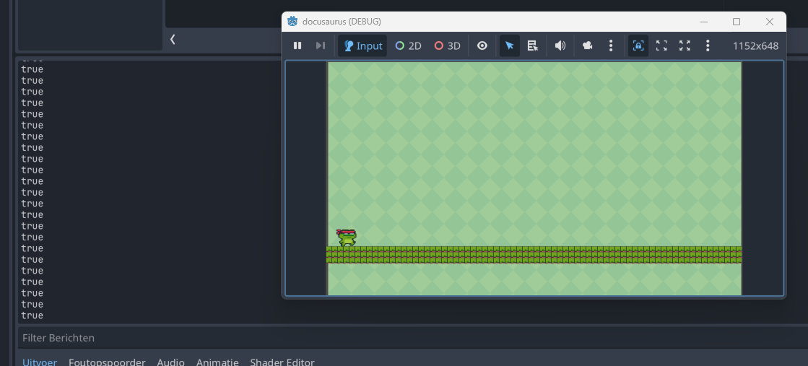

# Begrijpen basic movement script

De volgende opdrachten helpen je bij het begrijpen van het `basis movement script` dat Godot als standaard voorstelt.
De eerste keren dat je dit script bekijkt kan het lastig zijn. Vandaar hier enkele opdrachten om het script in de vingers te krijgen.


## SPEED aanpassen
Pas de waarde aan van `SPEED` naar 1000 en bekijk wat er gebeurt.

<details>
    <summary>Geef me de oplossing</summary>

Maak je huidige script helemaal leeg en vervang het door onderstaande code.
Als het goed is, gaat je character sneller bewegen.

```gdscript
extends CharacterBody2D


const SPEED = 1000.0
const JUMP_VELOCITY = -400.0


func _physics_process(delta: float) -> void:
	# Add the gravity.
	if not is_on_floor():
		velocity += get_gravity() * delta

	# Handle jump.
	if Input.is_action_just_pressed("ui_accept") and is_on_floor():
		velocity.y = JUMP_VELOCITY

	# Get the input direction and handle the movement/deceleration.
	# As good practice, you should replace UI actions with custom gameplay actions.
	var direction := Input.get_axis("ui_left", "ui_right")
	if direction:
		velocity.x = direction * SPEED
	else:
		velocity.x = move_toward(velocity.x, 0, SPEED)

	move_and_slide()
```
</details>


## JUMP_VELOCITY
Pas de waarde aan van `JUMP_VELOCITY` naar -800 en bekijk wat er gebeurt.

<details>
    <summary>Geef me de oplossing</summary>

Maak je huidige script helemaal leeg en vervang het door onderstaande code.
Als het goed is, gaat je character hoger springen.
Linksboven bij Godot is x=0 en y=0. Naar rechts wordt x hoger en naar beneden wordt y hoger.

```gdscript
extends CharacterBody2D


const SPEED = 300.0
const JUMP_VELOCITY = -400.0


func _physics_process(delta: float) -> void:
	# Add the gravity.
	if not is_on_floor():
		velocity += get_gravity() * delta

	# Handle jump.
	if Input.is_action_just_pressed("ui_accept") and is_on_floor():
		velocity.y = JUMP_VELOCITY

	# Get the input direction and handle the movement/deceleration.
	# As good practice, you should replace UI actions with custom gameplay actions.
	var direction := Input.get_axis("ui_left", "ui_right")
	if direction:
		velocity.x = direction * SPEED
	else:
		velocity.x = move_toward(velocity.x, 0, SPEED)

	move_and_slide()
```
</details>

## is_on_floor()

De functie `is_on_floor()` is erg belangrijk, want deze vertelt ons of de hoofdpersoon de vloer raakt.
Voeg onderstaande regel toe boven `if not is_on_floor():` en bekijk wat er gebeurt.

<details>
    <summary>Geef me de oplossing</summary>

Maak je huidige script helemaal leeg en vervang het door onderstaande code.
Als het goed is, zie je in de `Uitvoer` `false` als je hoofdpersoon de vloer raakt en `false` als dit niet zo is:



```gdscript
extends CharacterBody2D

const SPEED = 1000.0
const JUMP_VELOCITY = -800.0

func _physics_process(delta: float) -> void:
	# Add the gravity.
    print(is_on_floor())
	if not is_on_floor():
		velocity += get_gravity() * delta

	# Handle jump.
	if Input.is_action_just_pressed("ui_accept") and is_on_floor():
		velocity.y = JUMP_VELOCITY

	# Get the input direction and handle the movement/deceleration.
	# As good practice, you should replace UI actions with custom gameplay actions.
	var direction := Input.get_axis("ui_left", "ui_right")
	if direction:
		velocity.x = direction * SPEED
	else:
		velocity.x = move_toward(velocity.x, 0, SPEED)

	move_and_slide()
```
</details>

## Input.is_action_just_pressed

Dan komen we bij de input van de gebruiker:
```
Input.is_action_just_pressed("ui_accept")
```

`ui_accept` is de spatie bij Godot. Als je deze net hebt ingedrukt wordt deze methode waar, anders niet!


## Input.get_axis("ui_left", "ui_right")
Dit stukje code is een beetje ingewikkeld. Wat voor nu belangrijk is:
- als je links inhoudt --> direction = -1
- als je niets doet --> direction = 0
- als je rechts inhoudt --> direction = 1


## velocity
Velocity is iets ingewikkelder. Laten we eens bekijken wat de waarde is van `velocity`.
Voeg dit print statement toe aan je code:

```
print(velocity)
```

<details>
    <summary>Geef me de oplossing</summary>

Maak je huidige script helemaal leeg en vervang het door onderstaande code.
```gdscript
extends CharacterBody2D

const SPEED = 1000.0
const JUMP_VELOCITY = -800.0

func _physics_process(delta: float) -> void:
	# Add the gravity.
	if not is_on_floor():
		velocity += get_gravity() * delta

	# Handle jump.
	if Input.is_action_just_pressed("ui_accept") and is_on_floor():
		velocity.y = JUMP_VELOCITY

	# Get the input direction and handle the movement/deceleration.
	# As good practice, you should replace UI actions with custom gameplay actions.
	var direction := Input.get_axis("ui_left", "ui_right")
	if direction:
		velocity.x = direction * SPEED
	else:
		velocity.x = move_toward(velocity.x, 0, SPEED)

    print(velocity)

	move_and_slide()
```
</details>

Als je goed kijkt in de uitvoer, zie je verschillende waardes.
- Welke waardes zie je als je hoofdpersoon stilstaat?
- Welke waardes zie je als je hoofdpersoon naar rechts gaat?
- Welke waardes zie je als je hoofdpersoon naar links gaat?

<details>
    <summary>Geef me de oplossing</summary>

Stilstaan: (0,0)
Naar links: (-300, 0)
Naar rechts: (300, 0)
</details>

Velocity heeft twee waardes:
- `velocity.x`: hoeveel pixels horizontaal beweegt je hoofdpersoon per seconde?
- `velocity.y`: hoeveel pixels verticaal beweegt je hoofdpersoon per seconde?


